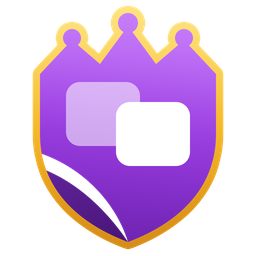

<p align="center"></p><h1 align="center">RoyaleImitate</h1>

<p align="center"><a href="https://github.com/RoyaleGym/RoyaleImitate/actions/workflows/suite.yml"></a>   <a href="https://royalegym.github.io/RoyaleGym/"></a> <a href="https://discord.gg/cvRu4nEGXY"></a> </p>

Start a Clash Royale bot from one you already have, and keep it close to that bot while it learns.
It is an optional add-on to RoyaleLearn, the trainer: leave it out and nothing changes.

## Install

    pip install "royalegym[all]"

This is the `[imitate]` part. On Windows with an NVIDIA card, install PyTorch first: [Install](https://royalegym.github.io/RoyaleGym/install/), step 4.

## Try it

```python
from royalegym import TowerHPReward, make_env
from royalelearn import Learner
from royaleimitate import save_actor

def build_env():
    return make_env(reward=TowerHPReward())

teacher = Learner(build_env, save_dir="runs/teacher")
teacher.learn(total_steps=20_000)
digest = save_actor(teacher, "runs/teacher-actor")

start = {"path": "runs/teacher-actor", "sha256": digest}
student = Learner(build_env, save_dir="runs/student", extensions={"warm_start": {"init": start}})
student.learn(total_steps=20_000)
```

The student starts from the teacher's weights; [examples/minimal.py](examples/minimal.py) also keeps it close.

## Next

- The docs: [royalegym.github.io/RoyaleGym](https://royalegym.github.io/RoyaleGym/), and the [RoyaleImitate page](https://royalegym.github.io/RoyaleGym/resources/royaleimitate/)
- The guide: [guide](https://royalegym.github.io/RoyaleGym/repos/royaleimitate/guide/). The full contract (Advanced): [spec](https://royalegym.github.io/RoyaleGym/repos/royaleimitate/spec/)
- Questions: [Discord](https://discord.gg/cvRu4nEGXY)

MIT licensed. See [LICENSE](LICENSE).
